# Porcana Database ERD

## Entity Relationship Diagram

```mermaid
erDiagram
    %% =====================================================
    %% User & Portfolio Domain
    %% =====================================================

    users ||--o{ portfolios : "owns"
    users ||--o| portfolios : "has main portfolio"

    users {
        UUID id PK
        string email UK "UNIQUE, NOT NULL"
        string password "nullable (OAuth)"
        string nickname "NOT NULL"
        enum provider "EMAIL, GOOGLE, APPLE"
        UUID main_portfolio_id FK "nullable"
        datetime created_at
        datetime updated_at
    }

    portfolios {
        UUID id PK
        UUID user_id FK "NOT NULL, indexed"
        string name "NOT NULL, max 100"
        enum status "DRAFT, ACTIVE, FINISHED"
        date started_at "nullable"
        datetime created_at
        datetime updated_at
    }

    %% =====================================================
    %% Portfolio Composition
    %% =====================================================

    portfolios ||--o{ portfolio_assets : "contains"
    portfolio_assets }o--|| assets : "references"

    portfolio_assets {
        UUID id PK
        UUID portfolio_id FK "NOT NULL, indexed"
        UUID asset_id FK "NOT NULL, indexed"
        decimal weight_pct "NOT NULL, (5,2)"
        datetime added_at
    }

    %% =====================================================
    %% Portfolio Snapshots (Time-series tracking)
    %% =====================================================

    portfolios ||--o{ portfolio_snapshots : "has snapshots"
    portfolio_snapshots ||--o{ portfolio_snapshot_assets : "contains"
    portfolio_snapshot_assets }o--|| assets : "references"

    portfolio_snapshots {
        UUID id PK
        UUID portfolio_id FK "NOT NULL, indexed"
        date effective_date "NOT NULL, unique per portfolio"
        string note "max 500"
        datetime created_at
    }

    portfolio_snapshot_assets {
        UUID id PK
        UUID snapshot_id FK "NOT NULL, indexed"
        UUID asset_id FK "NOT NULL, indexed"
        decimal weight "NOT NULL, (5,2)"
    }

    %% =====================================================
    %% Portfolio Returns (Daily calculation)
    %% =====================================================

    portfolios ||--o{ portfolio_daily_returns : "has returns"
    portfolio_daily_returns }o--|| portfolio_snapshots : "uses snapshot"

    portfolio_daily_returns {
        UUID id PK
        UUID portfolio_id FK "NOT NULL, indexed"
        UUID snapshot_id FK "NOT NULL, indexed"
        date return_date "NOT NULL, unique per portfolio"
        decimal return_total "NOT NULL, (10,4)"
        decimal return_local "NOT NULL, (10,4)"
        decimal return_fx "NOT NULL, (10,4)"
        datetime calculated_at
    }

    %% =====================================================
    %% Snapshot Asset Returns (Contribution analysis)
    %% =====================================================

    portfolios ||--o{ snapshot_asset_daily_returns : "has asset returns"
    portfolio_snapshots ||--o{ snapshot_asset_daily_returns : "has asset returns"
    snapshot_asset_daily_returns }o--|| assets : "references"

    snapshot_asset_daily_returns {
        UUID id PK
        UUID portfolio_id FK "NOT NULL, indexed"
        UUID snapshot_id FK "NOT NULL, indexed"
        UUID asset_id FK "NOT NULL, indexed"
        date return_date "NOT NULL, unique per (p,s,a,d)"
        decimal weight_used "NOT NULL, (5,2)"
        decimal asset_return_local "NOT NULL, (10,4)"
        decimal asset_return_total "NOT NULL, (10,4)"
        decimal fx_return "NOT NULL, (10,4)"
        decimal contribution_total "NOT NULL, (10,4)"
        datetime calculated_at
    }

    %% =====================================================
    %% Asset Master Data
    %% =====================================================

    assets {
        UUID id PK
        enum market "KR, US"
        string symbol "NOT NULL, max 20"
        string name "NOT NULL, max 200"
        enum type "STOCK, ETF"
        enum sector "GICS 11 sectors, nullable"
        enum asset_class "ETF class, nullable"
        list universe_tags "SP500, NASDAQ100, etc"
        boolean active "NOT NULL, indexed"
        integer current_risk_level "1-5, nullable"
        date as_of "NOT NULL"
        datetime created_at
        datetime updated_at
    }

    %% =====================================================
    %% Asset Price Data (EOD)
    %% =====================================================

    assets ||--o{ asset_prices : "has prices"

    asset_prices {
        UUID id PK
        UUID asset_id FK "NOT NULL, indexed"
        date price_date "NOT NULL, unique per asset"
        decimal price "NOT NULL, (20,4)"
        bigint volume "NOT NULL"
        datetime created_at
    }

    %% =====================================================
    %% Asset Risk History (Weekly calculation)
    %% =====================================================

    assets ||--o{ asset_risk_history : "has risk history"

    asset_risk_history {
        UUID id PK
        UUID asset_id FK "NOT NULL, indexed"
        string week "YYYY-WW, unique per asset"
        integer risk_level "1-5, NOT NULL"
        decimal risk_score "0-100, (5,2)"
        decimal volatility "(10,6)"
        decimal max_drawdown "(10,6)"
        decimal worst_day_return "(10,6)"
        text factors_snapshot "JSON"
        datetime created_at
    }

    %% =====================================================
    %% Exchange Rate Data
    %% =====================================================

    exchange_rates {
        UUID id PK
        enum currency_code "44 currencies"
        string currency_name "NOT NULL, max 100"
        decimal base_rate "NOT NULL, (15,2)"
        decimal buy_rate "(15,2)"
        decimal sell_rate "(15,2)"
        date exchange_date "NOT NULL, unique per currency"
        datetime created_at
    }

    %% =====================================================
    %% Arena Drafting System
    %% =====================================================

    portfolios ||--o{ arena_sessions : "has sessions"
    users ||--o{ arena_sessions : "participates"
    arena_sessions ||--o{ arena_rounds : "contains"
    arena_rounds }o--o{ assets : "presents/selects"

    arena_sessions {
        UUID id PK
        UUID portfolio_id FK "NOT NULL, indexed"
        UUID user_id FK "NOT NULL, indexed"
        enum status "IN_PROGRESS, COMPLETED, ABANDONED"
        integer current_round "NOT NULL, default 0"
        integer total_rounds "NOT NULL, default 11"
        enum risk_profile "SAFE, BALANCED, AGGRESSIVE"
        list selected_sectors "0-3 sectors"
        datetime created_at
        datetime updated_at
        datetime completed_at "nullable"
    }

    arena_rounds {
        UUID id PK
        UUID session_id FK "NOT NULL, indexed"
        integer round_number "NOT NULL, unique per session"
        enum round_type "PRE_ROUND, ASSET"
        list presented_asset_ids "UUIDs"
        UUID selected_asset_id FK "nullable"
        datetime created_at
        datetime picked_at "nullable"
    }
```



---

## Table Indexes Summary

### User & Portfolio
```sql
-- users
CREATE UNIQUE INDEX idx_users_email ON users(email);

-- portfolios
CREATE INDEX idx_portfolios_user_id ON portfolios(user_id);
CREATE INDEX idx_portfolios_status ON portfolios(status);

-- portfolio_assets
CREATE INDEX idx_portfolio_assets_portfolio_id ON portfolio_assets(portfolio_id);
CREATE INDEX idx_portfolio_assets_asset_id ON portfolio_assets(asset_id);
CREATE UNIQUE INDEX idx_portfolio_assets_portfolio_asset ON portfolio_assets(portfolio_id, asset_id);
```

### Portfolio Snapshots & Returns
```sql
-- portfolio_snapshots
CREATE INDEX idx_portfolio_snapshot_portfolio_id ON portfolio_snapshots(portfolio_id);
CREATE INDEX idx_portfolio_snapshot_effective_date ON portfolio_snapshots(effective_date);
CREATE UNIQUE INDEX idx_portfolio_snapshot_portfolio_date ON portfolio_snapshots(portfolio_id, effective_date);

-- portfolio_snapshot_assets
CREATE INDEX idx_portfolio_snapshot_asset_snapshot_id ON portfolio_snapshot_assets(snapshot_id);
CREATE INDEX idx_portfolio_snapshot_asset_asset_id ON portfolio_snapshot_assets(asset_id);
CREATE UNIQUE INDEX idx_portfolio_snapshot_asset_snapshot_asset ON portfolio_snapshot_assets(snapshot_id, asset_id);

-- portfolio_daily_returns
CREATE INDEX idx_portfolio_daily_return_portfolio_id ON portfolio_daily_returns(portfolio_id);
CREATE INDEX idx_portfolio_daily_return_snapshot_id ON portfolio_daily_returns(snapshot_id);
CREATE INDEX idx_portfolio_daily_return_date ON portfolio_daily_returns(return_date);
CREATE UNIQUE INDEX idx_portfolio_daily_return_portfolio_date ON portfolio_daily_returns(portfolio_id, return_date);

-- snapshot_asset_daily_returns
CREATE INDEX idx_snapshot_asset_daily_return_portfolio_id ON snapshot_asset_daily_returns(portfolio_id);
CREATE INDEX idx_snapshot_asset_daily_return_snapshot_id ON snapshot_asset_daily_returns(snapshot_id);
CREATE INDEX idx_snapshot_asset_daily_return_asset_id ON snapshot_asset_daily_returns(asset_id);
CREATE INDEX idx_snapshot_asset_daily_return_date ON snapshot_asset_daily_returns(return_date);
CREATE UNIQUE INDEX idx_snapshot_asset_daily_return_unique ON snapshot_asset_daily_returns(portfolio_id, snapshot_id, asset_id, return_date);
```

### Assets
```sql
-- assets
CREATE UNIQUE INDEX idx_asset_symbol_market ON assets(symbol, market);
CREATE INDEX idx_asset_active ON assets(active);
CREATE INDEX idx_asset_market ON assets(market);

-- asset_prices
CREATE UNIQUE INDEX idx_asset_price_asset_date ON asset_prices(asset_id, price_date);
CREATE INDEX idx_asset_price_date ON asset_prices(price_date);
CREATE INDEX idx_asset_price_asset ON asset_prices(asset_id);

-- asset_risk_history
CREATE UNIQUE INDEX idx_asset_risk_history_asset_week ON asset_risk_history(asset_id, week);
```

### Exchange Rates
```sql
-- exchange_rates
CREATE UNIQUE INDEX idx_exchange_rate_currency_date ON exchange_rates(currency_code, exchange_date);
CREATE INDEX idx_exchange_rate_date ON exchange_rates(exchange_date);
```

### Arena
```sql
-- arena_sessions
CREATE INDEX idx_arena_sessions_portfolio_id ON arena_sessions(portfolio_id);
CREATE INDEX idx_arena_sessions_user_id ON arena_sessions(user_id);
CREATE INDEX idx_arena_sessions_status ON arena_sessions(status);

-- arena_rounds
CREATE UNIQUE INDEX idx_arena_round_session_round ON arena_rounds(session_id, round_number);
```

---

## Key Relationships

### 1. User ↔ Portfolio
- **User → Portfolio** (1:N): 한 사용자가 여러 포트폴리오 소유
- **User → Portfolio** (1:1): 메인 포트폴리오 지정 (`main_portfolio_id`)

### 2. Portfolio → Assets
- **Portfolio → PortfolioAsset → Asset**: 포트폴리오 구성 자산 및 비중
- **Direct FK**: `portfolio_id`, `asset_id`

### 3. Portfolio Snapshots (Temporal Design)
- **PortfolioSnapshot**: 특정 시점의 포트폴리오 구성을 기록
- **PortfolioSnapshotAsset**: 스냅샷 시점의 자산별 비중
- **Purpose**: 리밸런싱 이력 추적, 시점별 수익률 계산

### 4. Returns Calculation Chain
```
Portfolio
  ↓
PortfolioSnapshot (effective_date)
  ↓
PortfolioDailyReturn (return_date, uses snapshot)
  ↓
SnapshotAssetDailyReturn (자산별 기여도)
```

### 5. Asset Master Data
- **Asset**: 종목 마스터 (symbol + market 조합으로 유니크)
- **AssetPrice**: 일별 종가 (asset_id + price_date 유니크)
- **AssetRiskHistory**: 주간 위험도 (asset_id + week 유니크)

### 6. Arena Drafting
- **ArenaSession**: 포트폴리오 드래프트 세션
- **ArenaRound**: 라운드별 선택지 및 선택 결과
- **Flow**: Round 0 (Pre Round: Risk Profile + Sectors) → Rounds 1-10 (Assets)

---

## Design Patterns

### 1. Temporal Data (Snapshot Pattern)
포트폴리오 구성이 변경될 때마다 새로운 스냅샷 생성:
- `effective_date`: 스냅샷 유효 시작일
- 수익률 계산 시 해당 시점의 스냅샷 사용

### 2. Immutable Price Data
- `asset_prices`: 과거 가격은 수정 불가, insert only
- `exchange_rates`: 과거 환율은 수정 불가, insert only
- Unique constraint로 중복 방지

### 3. Soft Delete (Active Flag)
- `assets.active`: 카드 풀 포함 여부 제어
- `active = false`: 비활성화 (삭제 아님, 이력 유지)

### 4. Denormalized Calculation Results
- `portfolio_daily_returns`: 일별 계산 결과 저장
- `snapshot_asset_daily_returns`: 자산별 기여도 저장
- **Reason**: 재계산 비용 절감, 쿼리 성능 최적화

### 5. Element Collection (JPA)
- `assets.universe_tags`: 별도 테이블 (`asset_universe_tags`)
- `arena_sessions.selected_sectors`: 별도 테이블 (`arena_session_sectors`)
- `arena_rounds.presented_asset_ids`: 별도 테이블 (`arena_round_choices`)

---

## Data Volume Estimation (Initial MVP)

| Table | Estimated Rows | Notes |
|-------|---------------|-------|
| users | 100-1,000 | MVP 초기 사용자 |
| portfolios | 300-3,000 | 사용자당 평균 3개 |
| portfolio_assets | 3,000-30,000 | 포트폴리오당 평균 10개 자산 |
| assets | ~1,000 | SP500(500) + KOSPI200(200) + KOSDAQ150(150) + ETF(150) |
| asset_prices | ~250,000/year | 1,000 assets × 250 trading days |
| exchange_rates | ~11,000/year | 44 currencies × 250 trading days |
| portfolio_snapshots | 300-3,000 | 포트폴리오당 평균 1개 (초기) |
| portfolio_daily_returns | ~750,000/year | 3,000 portfolios × 250 trading days |
| snapshot_asset_daily_returns | ~7,500,000/year | 750K returns × 10 assets |
| asset_risk_history | ~52,000/year | 1,000 assets × 52 weeks |
| arena_sessions | 300-3,000 | 포트폴리오 생성 시 1회 |
| arena_rounds | 3,300-33,000 | 세션당 11 라운드 |

---

## Maintenance Notes

### Daily Batch Jobs
- `asset_prices`: 한국 시장(18:00 KST), 미국 시장(07:00 KST)
- `exchange_rates`: 11:00 KST
- `portfolio_daily_returns`: 자산 가격 업데이트 후 계산
- `snapshot_asset_daily_returns`: 포트폴리오 수익률 계산과 함께

### Weekly Batch Jobs
- `assets`: 주간 종목 업데이트 (일요일 02:00 KST)
- `asset_risk_history`: 주간 위험도 계산 (일요일 03:00 KST)

### Data Retention
- `asset_prices`: 최소 2년 보관 (위험도 계산용)
- `exchange_rates`: 최소 2년 보관 (과거 수익률 계산용)
- `portfolio_daily_returns`: 영구 보관 (사용자 데이터)
- `snapshot_asset_daily_returns`: 영구 보관 (분석용)
- `asset_risk_history`: 영구 보관 (추세 분석용)